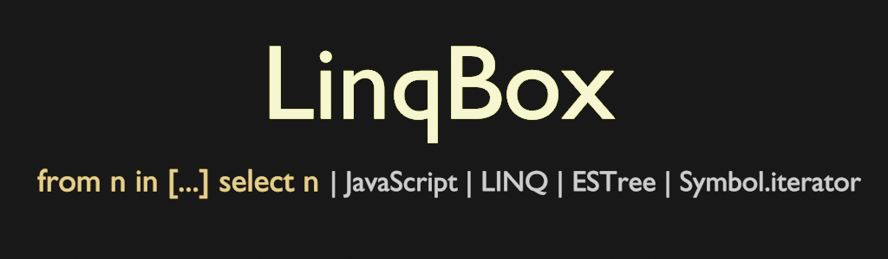

<div align='center'>

<h1>LinqBox</h1>

<p>Language Integrated Query for JavaScript</p>

[](https://badge.fury.io/js/%40sinclair%2Flinqbox)
[](https://github.com/sinclairzx81/linqbox/actions)


</img>

</div>


##### If it's possible in C#
```csharp
using System.Linq;

var query = from n in new int [] { 0, 1, 2 } select n + 1;

Console.WriteLine(query.ToList());
```
##### Let it be so for JavaScript
```typescript
import { linq } from '@sinclair/linqbox'

const query = linq `from n in [0, 1, 2] select n + 1`

console.log([...query])
```

<a name="Overview"></a>

## Overview

LinqBox is an experimental implementation of Language Integrated Query for JavaScript. It is written as an abstraction for JavaScript generators where it allows sequences of generators to be functionally composed through LINQ query expression syntax. 

 LinqBox provides a sole [Tagged Template](https://developer.mozilla.org/en-US/docs/Web/JavaScript/Reference/Template_literals) function as its API. Within it, one can write a typical LINQ expression. LinqBox will parse it, build a syntax tree representation of it; and construct a series of `function*` generators to execute the query at a later point in time. The queryable object it returns is a `Enumerable<T>` which houses the parsed syntax tree and which implements a `[Symbol.iterator]`. The syntax tree itself can be reflected and potentially mapped to other domains such as SQL.

LinqBox was written as a research project to explore leveraging LINQ as a form of unified query syntax for JavaScript. It does require an ES6+ JavaScript runtime, should work ok on most modern browsers.

This project is offered as is to anyone who may find it of use.

License MIT

## Contents

- [Overview](#Overview)
- [Install](#Install)
- [Syntax](#Syntax)
- [Keywords](#Keywords)

<a name="Install"></a>

## Install
```bash
$ npm install @sinclair/linqbox
```

<a name="Syntax"></a>

## Syntax

Linqbox implements a JavaScript version of LINQ as one would probably imagine it. Internally Linqbox parses for all JavaScript expressions (except functions) and constructs <a href="https://github.com/estree/estree">ESTree</a> based expressions trees that are extended to support the standard set of LINQ clauses and keywords. The following is a brief example of its usage. For more comprehensive information on LINQ, refer to the official Microsoft documentation located [here](https://docs.microsoft.com/en-us/dotnet/csharp/programming-guide/concepts/linq/).

### Example

```typescript
import { linq } from '@sinclair/linqbox'

const users = [
  { userid: 0, name: 'dave' },
  { userid: 1, name: 'bob' },
  { userid: 2, name: 'alice' },
  { userid: 3, name: 'roger' },
]
const records = [
  { recordid: 0, userid: 0, data: 'toaster' },
  { recordid: 1, userid: 2, data: 'fridge' },
  { recordid: 2, userid: 1, data: 'television' },
  { recordid: 3, userid: 4, data: 'toaster' },
  { recordid: 4, userid: 2, data: 'stove' },
  { recordid: 5, userid: 0, data: 'couch' },
  { recordid: 6, userid: 2, data: 'computer' },
  { recordid: 7, userid: 2, data: 'washing machine' },
  { recordid: 8, userid: 3, data: 'remote control' },
  { recordid: 9, userid: 1, data: 'air conditioner' },
]

const query = linq`
  from user in ${users}
  join record in ${records}
    on user.userid equals record.userid 
      into records
  select {
    user,
    records
  }`

for (const value of query) {
  console.log(value)
}
```
Results in the following output
```javascript
{
    user: { userid: 0, name: 'dave' },
    records: [
        { recordid: 0, userid: 0, data: 'toaster' },
        { recordid: 5, userid: 0, data: 'couch' }
    ]
}
{
    user: { userid: 1, name: 'bob' },
    records: [
        { recordid: 2, userid: 1, data: 'television' },
        { recordid: 9, userid: 1, data: 'air conditioner' }
    ]
}
{
    user: { userid: 2, name: 'alice' },
    records: [
        { recordid: 1, userid: 2, data: 'fridge' },
        { recordid: 4, userid: 2, data: 'stove' },
        { recordid: 6, userid: 2, data: 'computer' },
        { recordid: 7, userid: 2, data: 'washing machine' }
    ]
}
{
    user: { userid: 3, name: 'roger' },
    records: [
        { recordid: 8, userid: 3, data: 'remote control' }
    ]
}
```
<a name="Keywords"></a>

## Keywords

The following are the keywords supported by LinqBox. Most existing C# LINQ queries should trivially map to LinqBox with minimal changes. The following table lists them all with links to the official Microsoft documentation for additional information on how to use them. All are identical to the C# counterparts with the exception of `let` which has been renamed to `const` due to `let` having conflicting readonly semantics in C# that wouldn't make sense in JavaScript.

<table>
    <thead>
        <tr>
            <th>Clause</th>
            <th>Description</th>
        </tr>
    </thead>
    <tbody>
        <tr>
            <td><a href="https://docs.microsoft.com/en-us/dotnet/csharp/language-reference/keywords/from-clause">from</a></td>
            <td>Specifies a data source and a range variable (similar to an iteration variable).</td>
        </tr>
        <tr>
            <td><a href="https://docs.microsoft.com/en-us/dotnet/csharp/language-reference/keywords/where-clause">where</a></td>
            <td>Filters source elements based on one or more boolean expressions separated by logical AND and OR operators or for truthyness.</td>
        </tr>
        <tr>
            <td><a href="https://docs.microsoft.com/en-us/dotnet/csharp/language-reference/keywords/select-clause">select</a></td>
            <td>Specifies the type and shape that the elements in the returned sequence will have when the query is executed.</td>
        </tr>
        <tr>
            <td><a href="https://docs.microsoft.com/en-us/dotnet/csharp/language-reference/keywords/group-clause">group</a></td>
            <td>Groups query results according to a specified key value.</td>
        </tr>
        <tr>
            <td><a href="https://docs.microsoft.com/en-us/dotnet/csharp/language-reference/keywords/into">into</a></td>
            <td>Provides an identifier that can serve as a reference to the results of a join, group or select clause.</td>
        </tr>
        <tr>
            <td><a href="https://docs.microsoft.com/en-us/dotnet/csharp/language-reference/keywords/orderby-clause">orderby</a></td>
            <td>Sorts query results in ascending or descending order based on the default comparer for the element type.</td>
        </tr>
        <tr>
            <td><a href="https://docs.microsoft.com/en-us/dotnet/csharp/language-reference/keywords/join-clause">join</a></td>
            <td>Joins two data sources based on an equality comparison between two specified matching criteria.</td>
        </tr>
        <tr>
            <td><a href="https://docs.microsoft.com/en-us/dotnet/csharp/language-reference/keywords/let-clause">const</a></td>
            <td>Same as <a href="https://docs.microsoft.com/en-us/dotnet/csharp/language-reference/keywords/let-clause">let</a>. Introduces a range variable to store sub-expression results in a query expression. </td>
        </tr>
        <tr>
            <td><a href="https://docs.microsoft.com/en-us/dotnet/csharp/language-reference/keywords/in">in</a></td>
            <td>Contextual keyword in a <a href="https://docs.microsoft.com/en-us/dotnet/csharp/language-reference/keywords/join-clause">join</a> clause.</td>
        </tr>
        <tr>
            <td><a href="https://docs.microsoft.com/en-us/dotnet/csharp/language-reference/keywords/on">on</a></td>
            <td>Contextual keyword in a <a href="https://docs.microsoft.com/en-us/dotnet/csharp/language-reference/keywords/join-clause">join</a> clause.</td>
        </tr>
        <tr>
            <td><a href="https://docs.microsoft.com/en-us/dotnet/csharp/language-reference/keywords/equals">equals</a></td>
            <td>Contextual keyword in a <a href="https://docs.microsoft.com/en-us/dotnet/csharp/language-reference/keywords/join-clause">join</a> clause.</td>
        </tr>
        <tr>
            <td><a href="https://docs.microsoft.com/en-us/dotnet/csharp/language-reference/keywords/equals">by</a></td>
            <td>Contextual keyword in a <a href="https://docs.microsoft.com/en-us/dotnet/csharp/language-reference/keywords/group-clause">group</a> clause.</td>
        </tr>
        <tr>
            <td><a href="https://docs.microsoft.com/en-us/dotnet/csharp/language-reference/keywords/ascending">ascending</a></td>
            <td>Contextual keyword in a <a href="https://docs.microsoft.com/en-us/dotnet/csharp/language-reference/keywords/orderby-clause">orderby</a> clause.</td>
        </tr>
        <tr>
            <td><a href="https://docs.microsoft.com/en-us/dotnet/csharp/language-reference/keywords/descending">descending</a></td>
            <td>Contextual keyword in a <a href="https://docs.microsoft.com/en-us/dotnet/csharp/language-reference/keywords/orderby-clause">orderby</a> clause.</td>
        </tr>
    </tbody>
</table>


